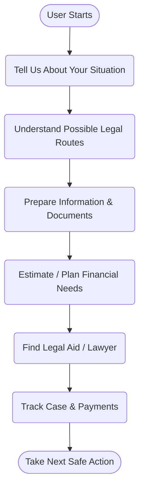
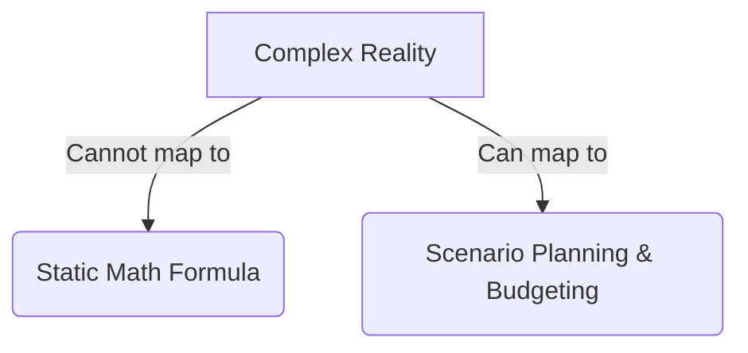
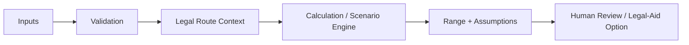
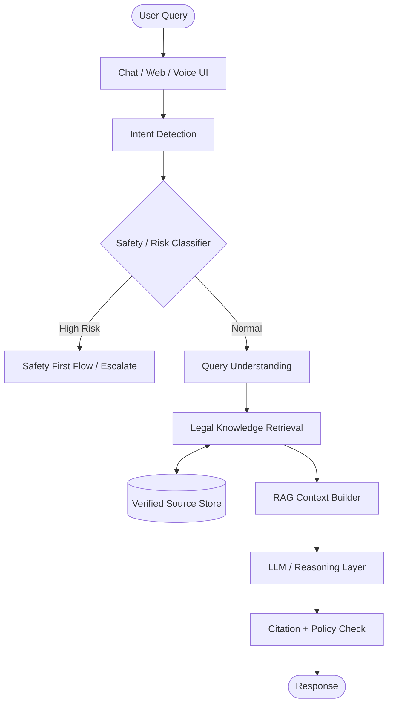
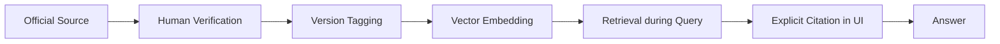
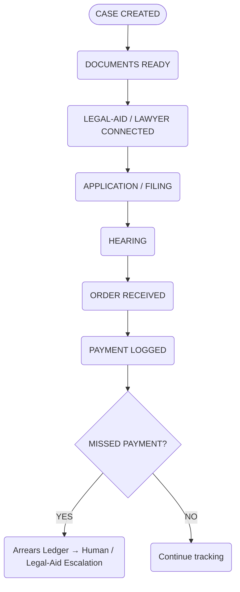
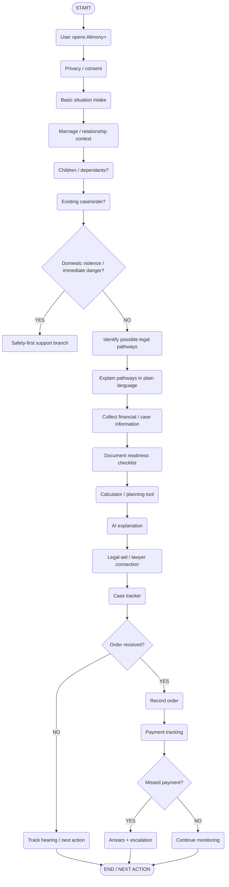
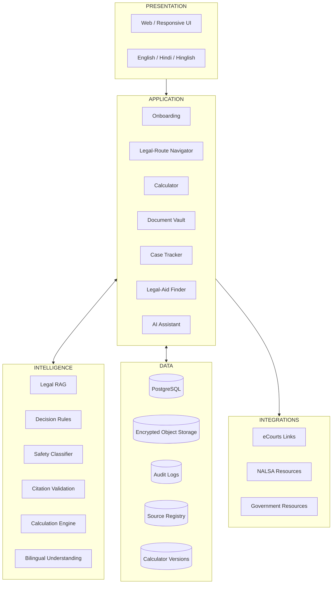
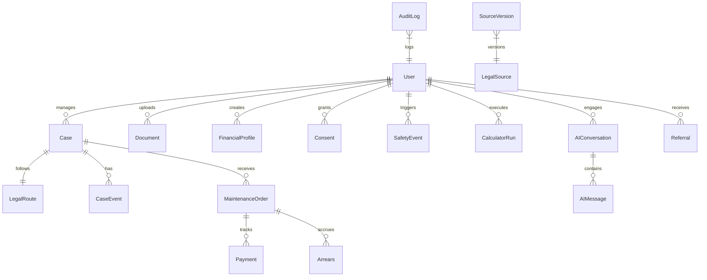
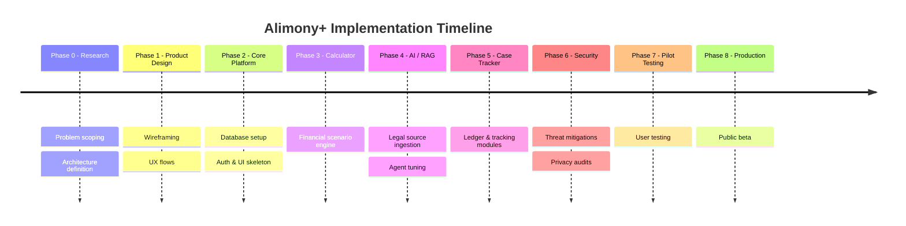

<div align="center">
  
  <h1 style="border-bottom: none; margin-top: 0;">Alimony+</h1>
  <p style="font-size: 1.1em;"><strong>Making the maintenance journey clearer, more prepared, more trackable and more accessible.</strong></p>
  
  <p>
    
    
    
    
  </p>
</div>

---

**Alimony+ is a Tech Tomorrow group project exploring how technology can reduce information, preparation, tracking, and access barriers in maintenance and alimony journeys in India.**

> **LEGAL DISCLAIMER:** Alimony+ is a technology and research project and does not provide individualized legal advice. Information is intended for general educational and navigational purposes. Legal rights, procedures, and outcomes depend on facts, jurisdiction, applicable law, and current judicial interpretation. Users should consult a qualified advocate or official legal-aid service for case-specific assistance.

---

## Run the frontend prototype

```sh
cd frontend
npm ci
npm run dev
```

Open http://127.0.0.1:3000 to explore the labeled synthetic demo. Case creation, order/payment forms, a monthly demonstration ledger, document readiness, planning scenarios and a structured-data review/export workspace are included.

See [frontend setup and limitations](frontend/README.md) and [backend/AI integration handoff](frontend/API-HANDOFF.md). The existing backend can be connected for supported APIs. Hearing dates, monthly payment schedules and period allocations still require backend extensions before the live ledger can be enabled. No production database or AI service is bundled with the demo.

---

## 📑 Table of Contents

- [Executive Summary](#executive-summary)
- [Why Alimony+?](#why-alimony)
- [The Reality of the Problem](#the-reality-of-the-problem)
- [Indian Legal Landscape](#indian-legal-landscape)
- [Key Judicial Guidance](#key-judicial-guidance)
- [Why Alimony+ Cannot Be Just an Alimony Calculator](#why-alimony-cannot-be-just-an-alimony-calculator)
- [Maintenance Planning Calculator](#maintenance-planning-calculator)
- [AI Assistant](#ai-assistant)
- [AI Architecture](#ai-architecture)
- [Legal Source Registry](#legal-source-registry)
- [Safety & Responsible AI](#safety--responsible-ai)
- [Document Readiness & Secure Case Packet](#document-readiness--secure-case-packet)
- [Case & Maintenance Tracker](#case--maintenance-tracker)
- [Connecting Users to Legal Aid](#connecting-users-to-legal-aid)
- [eCourts & Case Tracking](#ecourts--case-tracking)
- [Real End-to-End Product Flow](#real-end-to-end-product-flow)
- [System Architecture](#system-architecture)
- [Database Diagram](#database-diagram)
- [Security Threat Model](#security-threat-model)
- [What Alimony+ Does & Does Not Do](#what-alimony-does--does-not-do)
- [Technology Stack](#technology-stack)
- [Project Status & Roadmap](#project-status--roadmap)
- [Group Project Structure](#group-project-structure)
- [Testing & Acceptance Criteria](#testing--acceptance-criteria)
- [What We Still Need to Learn](#what-we-still-need-to-learn)
- [Success Metrics](#success-metrics)
- [Sources & Further Reading](#sources--further-reading)

---

## Executive Summary

**What is Alimony+?**  
Alimony+ is an India-focused legal-assistance platform that provides tools for understanding, estimating, and organizing maintenance claims. 

**Who is it for?**  
It is primarily designed for women seeking to understand their rights and potential pathways for financial support (maintenance/alimony), especially those facing information barriers, legal confusion, or domestic safety risks.

**Why does it exist?**  
The Indian legal system has multiple overlapping laws for maintenance. Litigants often lack clarity on their rights, struggle to gather necessary financial documents, and face delays. Alimony+ exists to bridge the gap between confusion and professional legal aid by making the litigant organized and prepared.

**What makes it different?**  
It is not simply an "AI lawyer." It is a structured journey designed to organize the user's facts safely before connecting them to human legal resources.

### The Core User Journey



---

## Why Alimony+?

The challenge of securing maintenance in India goes far beyond simply "not knowing the law." The real problem includes:

1. **Multiple Legal Pathways:** A user might be eligible under the Hindu Marriage Act, the Protection of Women from Domestic Violence Act, or the Bharatiya Nagarik Suraksha Sanhita (BNSS).
2. **Terminology Barriers:** Confusion between interim maintenance, permanent alimony, and monetary relief.
3. **Evidence Burden:** Difficulty understanding how to prepare and disclose assets, income, and liabilities.
4. **Tracking Disconnects:** Difficulty tracking interim-maintenance arrears and missed payments after a court order is passed.
5. **Access to Free Legal Aid:** Many marginalized individuals are unaware of the National Legal Services Authority (NALSA) or State Legal Services Authorities (SLSAs).
6. **Privacy & Safety Risks:** Domestic violence situations requiring immediate, safety-first responses rather than long-term legal strategy.
7. **English-Language Barriers:** Most official court resources and legal interpretations are highly technical and exclusively in English.

### The Alimony+ Approach

| **Problem** | **Why It Happens** | **Real-World Effect** | **What Alimony+ Can Do** |
|-------------|--------------------|-----------------------|--------------------------|
| **Route Confusion** | Multiple statutory frameworks & overlapping remedies. | Applicant doesn't know which law applies or who to approach. | **Guided Legal Navigator:** Explains possible pathways in plain English/Hindi and clearly indicates when human legal review is required. |
| **Evidence Gathering** | Lack of structured format for financial disclosure. | Applications get delayed due to incomplete affidavits. | **Document Vault:** Helps users organize their financial affidavits (assets, liabilities, income) before seeing a lawyer. |
| **Maintenance Arrears** | No automated way to track missed court-mandated payments. | Litigant struggles to prove non-payment to the court. | **Ledger Tracker:** A simple, digital ledger to log received and missed payments. |

---

## The Reality of the Problem

<div align="center">
  
  <br>
  <em>(The painful reality of domestic struggles and waiting for justice. Many face immense anxiety and confusion without structured guidance. This is why Alimony+ exists: to turn distress into prepared action.)</em>
</div>
<br>

Understanding the legal ecosystem in India requires acknowledging how courts and legal aid services currently operate. 

<div align="center">
  
  <br>
  <em>(Official NALSA portal showing women's eligibility for free legal services. Source: nalsa.gov.in. Purpose: Demonstrates the existing legitimate infrastructure that Alimony+ aims to connect users to.)</em>
</div>

<br>

<div align="center">
  
  <br>
  <em>(Official eCourts interface showing case-status search options. Source: services.ecourts.gov.in. Purpose: Demonstrates how users currently interact with official case-status systems which Alimony+ tracking aims to simplify.)</em>
</div>

---

## Indian Legal Landscape

In India, "alimony" is a common parlance term, but the law provides for "maintenance" (interim and permanent) and "monetary relief" across different statutes depending on religion, marital status, and the nature of the dispute. 

| **Statute & Provision** | **Who Uses It** | **What It Deals With** | **Alimony+ Data Collection** |
|-------------------------|-----------------|------------------------|------------------------------|
| **Bharatiya Nagarik Suraksha Sanhita, 2023 (Sec 144)** *(formerly CrPC 125)* | Wives, children, and parents unable to maintain themselves. | A fast-track, secular remedy to prevent vagrancy and destitution. | Basic income/expense details; relationship proof. |
| **Protection of Women from Domestic Violence Act, 2005 (Sec 20)** | Aggrieved women in a domestic relationship. | Monetary relief to meet expenses incurred and losses suffered due to domestic violence. | Specifics of living expenses, medical costs, and housing. |
| **Hindu Marriage Act, 1955 (Sec 24 & 25)** | Spouses (Hindu). | Interim maintenance during proceedings (Sec 24) and permanent alimony upon decree (Sec 25). | Comprehensive asset/liability disclosures (as mandated by SC guidelines). |
| **Special Marriage Act, 1954 (Sec 36 & 37)** | Spouses married under SMA. | Interim and permanent alimony similar to HMA, but secular in nature. | Financial disclosure and dependency data. |
| **Hindu Adoptions and Maintenance Act, 1956 (Sec 18)** | Hindu wives. | Right to claim maintenance while living separately under specific grounds. | Causes for separation and financial dependency proofs. |

> **IMPORTANT:** Alimony+ does NOT conclude which law applies to a specific user. It maps the user's facts to potential options and organizes the data for a human lawyer to review.

---

## Key Judicial Guidance

Product design in legal-tech must be strictly guided by Supreme Court jurisprudence.

### *Rajnesh v. Neha (2020)*
This landmark Supreme Court judgment standardized maintenance procedures across India.

- **Overlapping Jurisdictions:** The court noted that multiple proceedings (e.g., under DV Act and CrPC) can cause conflicting orders. 
  - **Product Implication:** Alimony+ includes a duplicate/overlapping proceeding warning in the Case Tracker.
- **Disclosure of Assets/Income:** The court mandated a strict "Affidavit of Disclosure of Assets and Liabilities."
  - **Product Implication:** Alimony+ uses a structured financial disclosure workflow to help users prepare this exact data before meeting a lawyer.
- **Date of Award:** Maintenance is generally awarded from the date of the application.
  - **Product Implication:** The Case Tracker emphasizes the filing date to track total accrued arrears accurately.

---

## Why Alimony+ Cannot Be Just an Alimony Calculator

Courts do not use one universal, algorithmic formula that guarantees an exact award. A static calculator cannot account for human nuance.

Factors that courts consider include:
- Independent income of the applicant.
- Reasonable needs of the applicant and dependants.
- Standard of living enjoyed during the marriage.
- Educational and professional qualifications.
- Family-care responsibilities and liabilities.

**Therefore, Alimony+ will NEVER say:** *"You will definitely receive ₹35,000/month."*

**Instead, Alimony+ states:** *"Based on the information entered, this planning estimate falls within this range under the selected methodology. Actual entitlement and award depend on the applicable law, evidence, and competent authority/court."*



---

## Maintenance Planning Calculator

The planning calculator helps the user structure a realistic budget and expectation before engaging in litigation.

**Inputs:**
- Applicant & Respondent (estimated) income.
- Essential living & housing expenses.
- Children/dependants (medical & educational needs).
- Existing liabilities and existing maintenance orders.
- Case stage and selected legal route.

**Outputs:**
- A planning range/scenario.
- Transparent assumptions.
- Data completeness indicator.
- Strict *"Not a court prediction"* warning.
- Source/version information of the logic.



---

## AI Assistant

<div align="center">
  
</div>

The Alimony+ AI Assistant is a grounded legal-information tool, **not an autonomous lawyer.**

**Capabilities:**
- Answers general legal-information questions in simple language.
- Explains terminology in English, Hindi, and Hinglish.
- Summarizes approved sources.
- Asks structured follow-up questions to understand context.
- Surfaces verified legal-aid resources.

**Example Interaction:**
> **User:** *"Mere husband ka income mujhe nahi pata, main maintenance ke liye kya kar sakti hoon?"*  
> **AI:** Explains that financial information matters, suggests gathering available documents (like tax returns or lifestyle proofs if accessible legally), explains how courts can order disclosure, and recommends professional legal review. It **avoids** inventing income numbers or suggesting illegal snooping.

---

## AI Architecture

The system uses a highly constrained Retrieval-Augmented Generation (RAG) pipeline to ensure answers are strictly based on Indian law.



---

## Legal Source Registry

Every legal answer provided by the AI must be grounded in a verified, versioned knowledge base. The model does NOT blindly "remember" the law.



**Metadata Stored per Source:**
`Title` | `Type` | `URL` | `Law/Case` | `Section` | `Publication Date` | `Effective Date` | `Last Reviewed` | `Reviewer` | `Status` | `Superseded By`

---

## Safety & Responsible AI

Legal and domestic-violence-related data is extremely sensitive. 

- **Privacy by Design:** Data minimization, encryption at rest, secure session management, and role-based access.
- **Safe Exit:** A quick-escape button to hide the tab instantly.
- **Domestic Violence Handling:** If a user discloses immediate danger or violence, the AI **does not** attempt to negotiate, investigate the attacker, or give dangerous instructions. It switches to a safety-first flow, providing verified emergency contacts and urging human support.
- **Adversarial Defenses:** Prompt injection and malicious document analysis defenses are integrated. No user's case is ever exposed to another user.

---

## Document Readiness & Secure Case Packet

Users often struggle to compile evidence. The Document Vault helps them organize lawful evidence (identity, marriage proofs, income, expenses, children's documents, court notices) securely.

- **Encrypted Storage with Access Controls.**
- **Classification & Retention Rules.**
- **No Fabrication:** The system explicitly warns against and refuses to assist in creating fake salary slips or fabricated evidence.

---

## Case & Maintenance Tracker

A post-order utility to track hearings, mandates, and payments.



---

## Connecting Users to Legal Aid

Alimony+ does not replace the court. Its goal is to connect organized, prepared users with official authorities. We guide users to the **National Legal Services Authority (NALSA)**, SLSAs, DLSAs, and TLSCs.


---

## eCourts & Case Tracking

*(PROPOSED FUTURE FEATURE)*
Alimony+ plans to guide users toward verified eCourts services. Currently, Alimony+ acts as a local metadata tracker. It does **not** claim to have an official API integration with eCourts. Instead: *"Alimony+ can guide users toward verified eCourts services and can store user-entered case metadata."*

---

## Real End-to-End Product Flow



---

## System Architecture



---

## Database Diagram

*(PROPOSED SCHEMA)*



---

## Security Threat Model

| **Threat** | **Mitigation** | **Test** |
|------------|----------------|----------|
| **Prompt Injection** | Isolate retrieved documents from system instructions. | Adversarial test suite. |
| **Unauthorized Case Access (IDOR)** | Strict RLS (Row Level Security) and user-bound sessions. | Penetration testing on API endpoints. |
| **Hallucinated Legal Advice** | Strict RAG grounding; refuse out-of-domain queries. | Evaluation against expert corpus. |
| **Malicious Document Instructions** | Strip metadata and sanitize PDFs before OCR/embedding. | Malicious file uploads. |
| **Public Case Exposure** | Default private, no public indexing, encryption at rest. | Privacy audit. |

---

## What Alimony+ Does & Does Not Do

### ✅ What Alimony+ DOES:
- Explain maintenance concepts.
- Guide users through possible pathways.
- Ask structured questions & organize information.
- Estimate planning scenarios.
- Maintain a case timeline & arrears ledger.
- Provide verified legal-aid links.
- Summarize approved legal sources bilingually.
- Flag uncertainty & escalate to humans when needed.

### 🚫 What Alimony+ DOES NOT DO:
- **It does NOT guarantee alimony.**
- **It does NOT decide legal entitlement.**
- **It does NOT predict a court order with certainty.**
- **It does NOT replace a lawyer or impersonate a court.**
- **It does NOT submit legal documents autonomously without appropriate review.**
- **It does NOT contact or threaten the opposing party.**
- **It does NOT fabricate evidence (e.g., fake salary slips).**
- **It does NOT provide dangerous instructions in safety situations.**

---

## Technology Stack

**CURRENT:**
- *Frontend:* Next.js + React + TypeScript + Tailwind CSS prototype in `frontend/`.
- *Backend:* Existing Express APIs for auth, cases, proceedings, orders, payments, documents and planning calculations.
- *Database:* PostgreSQL / Prisma contract present; requires a configured database.

**PLANNED:**
- *Frontend:* Next.js (React), Tailwind CSS
- *Backend:* Node.js / Serverless API routes
- *Database:* PostgreSQL (Prisma ORM)
- *AI/RAG:* LangChain, Vector Database
- *Storage:* AWS S3 (Encrypted) / Vercel Blob
- *Authentication:* NextAuth / Clerk

---

## Project Status & Roadmap

| Area | Status | Notes |
|------|--------|-------|
| Research & Documentation | ✅ Complete | Initial architecture and legal landscape defined. |
| Legal Source Registry | 🚧 In Progress | Compiling India Code & SC judgments. |
| UI & Authentication | Prototype implemented | Responsive frontend and backend login adapter; deployment validation remains. |
| Calculator & Case Tracker | Prototype implemented | Live supported records; scheduled ledger/hearing workflows demonstrated with synthetic data. |
| AI / RAG Implementation | 📋 Planned | - |
| Document Vault | 📋 Planned | - |
| Security & Testing | 📋 Planned | - |

### Roadmap



---

## Group Project Structure

**FEATURE → OWNER → REVIEWER → TEST → SOURCE**

- **Legal Research:** Defines source registry → Review by peers → Accuracy checks against India Code.
- **Product/UX:** Wireframes user journey → Review by engineering → Usability testing.
- **Frontend/Backend:** Builds UI and APIs → Code reviews → E2E tests.
- **AI/ML:** Builds RAG pipeline → Review by Legal Research → Hallucination & Prompt Injection tests.
- **Security & QA:** Penetration and data audits → Review by Architecture Lead → IDOR/Privacy testing.

---

## Testing & Acceptance Criteria

- **Legal Accuracy:** Tested against 50+ real-world legal queries mapped to the approved corpus.
- **Bilingual Tests:** Verified comprehension in English, Hindi, and Hinglish.
- **Calculator Tests:** Fixed test vectors for accurate mathematical scenario planning.
- **Safety Tests:** Strict evaluation of system response to domestic violence / urgent risk inputs.
- **Security & Privacy Tests:** IDOR, XSS, CSRF, auth bypass, file access, and cross-user authorization attempts.
- **AI Tests:** Prompt injection, malicious document, hallucination, and stale source evaluations.
- **Accessibility Tests:** Mobile responsiveness, keyboard navigation, screen reader support, contrast, and font readability.

---

## What We Still Need to Learn

- **Maintenance-specific national datasets** are highly limited in India; court-level outcomes vary drastically.
- **Legal rules and interpretations** change; maintaining an up-to-date corpus is challenging.
- **Local procedures** differ significantly from state to state.
- **Reliable income information** is difficult for applicants to obtain prior to court-ordered disclosures.
- **AI evaluation** requires a legal expert-reviewed corpus, which is an ongoing resource challenge.

---

## Success Metrics

*(PROPOSED)*
- **AI Performance:** Legal-answer citation coverage (>95%), hallucination rate (<1%), unsafe-response rate (0%).
- **User Journey:** Completion rate of intake, document-readiness completion, and legal-aid referral completion.
- **Platform Health:** Source freshness and calculator reproducibility.
- **Accessibility:** High accessibility score and bilingual comprehension accuracy.

---

## Sources & Further Reading

- [National Legal Services Authority (NALSA) - Women's Assistance](https://nalsa.gov.in/services/legal-services/women) - *Official legal aid portal for marginalized groups in India.*
- [eCourts Services India](https://services.ecourts.gov.in/) - *Official portal for tracking case status and judgments across district and high courts.*
- [India Code](https://www.indiacode.nic.in/) - *Digital repository of all Central and State Acts (including HMA, DV Act, BNSS).*
- [Supreme Court of India - Judgments](https://main.sci.gov.in/judgments) - *Primary source for defining precedents like Rajnesh v. Neha (2020) detailing maintenance guidelines.*
- [Digital Personal Data Protection Act (DPDP Act)](https://www.meity.gov.in/data-protection-framework) - *Guidelines shaping the privacy and retention architecture for user data.*

---

<div align="center">
  <em>Alimony+ is not trying to replace the legal system. It is trying to make the legal journey easier to understand.</em>
</div>
